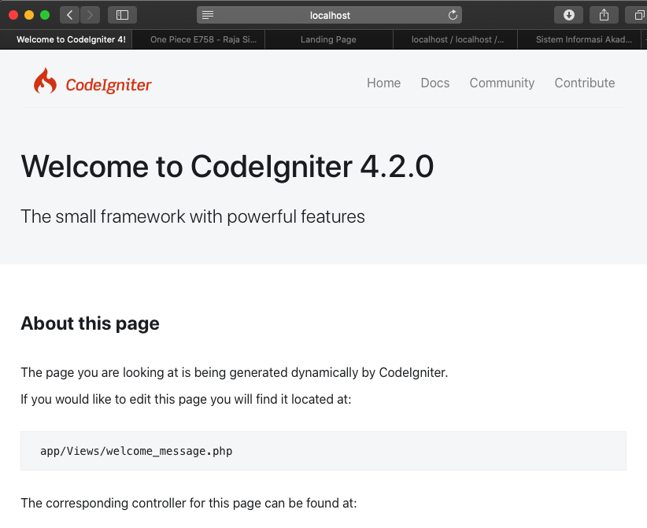
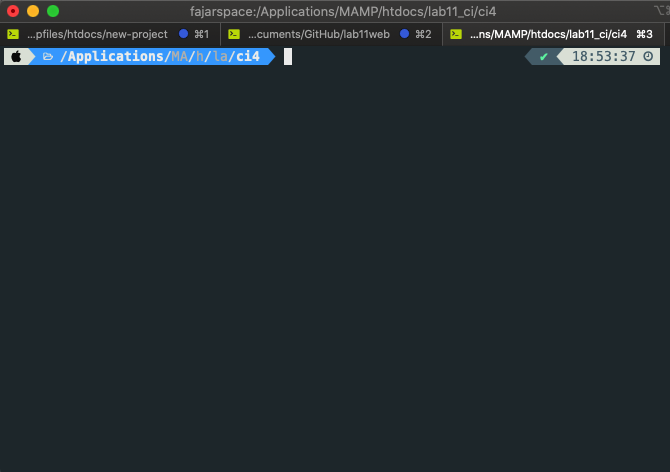
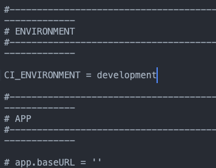
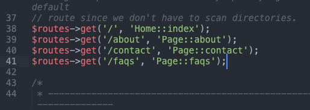
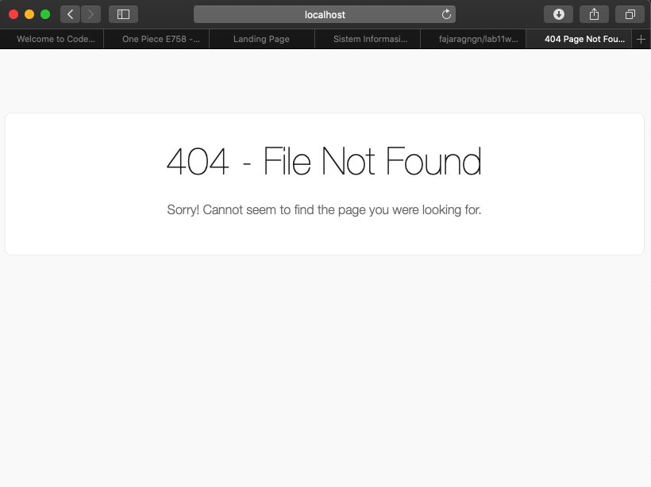
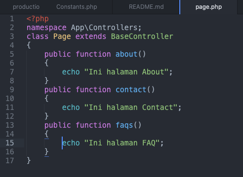
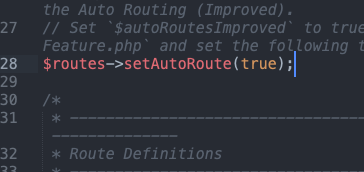
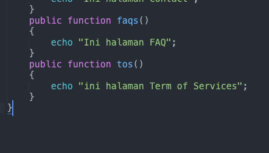
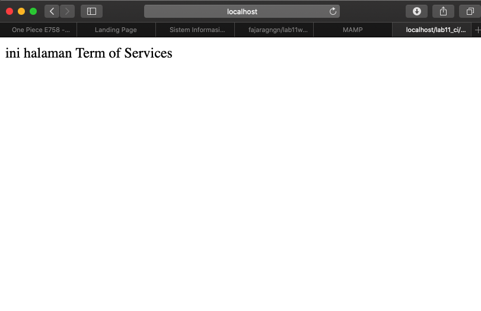

| Nama      | Fajar Agung Nugroho |
| ----------- | ----------- |
| NIM     | 312010448       |
| Kelas   | TI.20.A.1        |

## Langkah langkah praktikum 11

## 1. Buat file baru dengan nama header.php
### Instalasi Codeigniter 4
Untuk melakukan instalasi Codeigniter 4 dapat dilakukan dengan dua cara, yaitu cara
manual dan menggunakan composer. Pada praktikum ini kita menggunakan cara
manual

• Unduh Codeigniter dari website https://codeigniter.com/download

• Extrak file zip Codeigniter ke direktori htdocs/lab11_ci.

• Ubah nama direktory framework-4.x.xx menjadi ci4.

• Buka browser dengan alamat http://localhost/lab11_ci/ci4/public/

## 2. Menjalankan CLI (Command Line Interface)
Codeigniter 4 menyediakan CLI untuk mempermudah proses development. Untuk
mengakses CLI buka terminal/command prompt.

## 3. Mengaktifkan Mode Debugging
Codeigniter 4 menyediakan fitur debugging untuk memudahkan developer untuk
mengetahui pesan error apabila terjadi kesalahan dalam membuat kode program.

Ubah nama file env menjadi .env kemudian buka file tersebut dan ubah nilai variable
CI_ENVIRINMENT menjadi development.

## 4. Membuat Route Baru.
Tambahkan kode berikut di dalam Routes.php

Selanjutnya coba akses route yang telah dibuat dengan mengakses alamat url http://localhost:8080/about

Ketika diakses akan mucul tampilan error 404 file not found, itu artinya file/page
tersebut tidak ada. Untuk dapat mengakses halaman tersebut, harus dibuat terlebih
dahulu Contoller yang sesuai dengan routing yang dibuat yaitu Contoller Page.

## 5. Membuat Controller
Selanjutnya adalah membuat Controller Page. Buat file baru dengan nama page.php
pada direktori Controller kemudian isi kodenya seperti berikut.

Selanjutnya refresh Kembali browser, maka akan ditampilkan hasilnya yaitu halaman
sudah dapat diakses.

## 6. Auto Routing
Secara default fitur autoroute pada Codeiginiter sudah aktif. Untuk mengubah status
autoroute dapat mengubah nilai variabelnya. Untuk menonaktifkan ubah nilai true
menjadi false.

Tambahkan method baru pada Controller Page seperti berikut.

Method ini belum ada pada routing, sehingga cara mengaksesnya dengan menggunakan alamat: http://localhost:8080/page/tos

