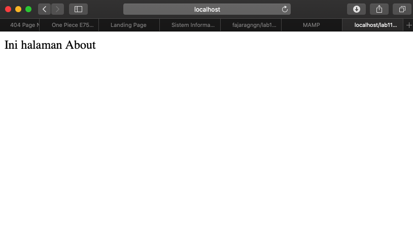
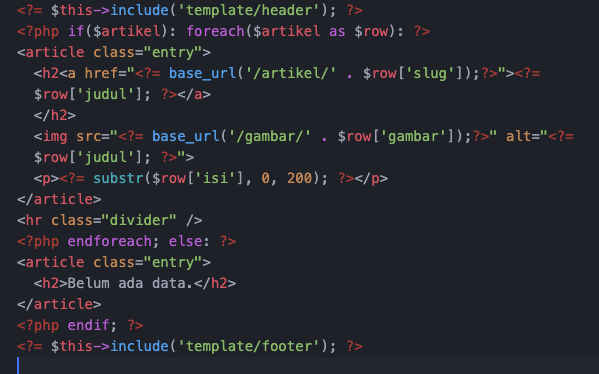

| Nama      | Fajar Agung Nugroho |
| ----------- | ----------- |
| NIM     | 312010448       |
| Kelas   | TI.20.A.1        |

## Langkah langkah praktikum 11

## 1. Buat file baru dengan nama header.php
### Instalasi Codeigniter 4
Untuk melakukan instalasi Codeigniter 4 dapat dilakukan dengan dua cara, yaitu cara
manual dan menggunakan composer. Pada praktikum ini kita menggunakan cara
manual

• Unduh Codeigniter dari website https://codeigniter.com/download

• Extrak file zip Codeigniter ke direktori htdocs/lab11_ci.

• Ubah nama direktory framework-4.x.xx menjadi ci4.

• Buka browser dengan alamat http://localhost/lab11_ci/ci4/public/

## 2. Menjalankan CLI (Command Line Interface)
Codeigniter 4 menyediakan CLI untuk mempermudah proses development. Untuk
mengakses CLI buka terminal/command prompt.

## 3. Mengaktifkan Mode Debugging
Codeigniter 4 menyediakan fitur debugging untuk memudahkan developer untuk
mengetahui pesan error apabila terjadi kesalahan dalam membuat kode program.

Ubah nama file env menjadi .env kemudian buka file tersebut dan ubah nilai variable
CI_ENVIRINMENT menjadi development.

## 4. Membuat Route Baru.
Tambahkan kode berikut di dalam Routes.php

Selanjutnya coba akses route yang telah dibuat dengan mengakses alamat url http://localhost:8080/about

Ketika diakses akan mucul tampilan error 404 file not found, itu artinya file/page
tersebut tidak ada. Untuk dapat mengakses halaman tersebut, harus dibuat terlebih
dahulu Contoller yang sesuai dengan routing yang dibuat yaitu Contoller Page.

## 5. Membuat Controller
Selanjutnya adalah membuat Controller Page. Buat file baru dengan nama page.php
pada direktori Controller kemudian isi kodenya seperti berikut.

Selanjutnya refresh Kembali browser, maka akan ditampilkan hasilnya yaitu halaman
sudah dapat diakses.

## 6. Auto Routing
Secara default fitur autoroute pada Codeiginiter sudah aktif. Untuk mengubah status
autoroute dapat mengubah nilai variabelnya. Untuk menonaktifkan ubah nilai true
menjadi false.

Tambahkan method baru pada Controller Page seperti berikut.

Method ini belum ada pada routing, sehingga cara mengaksesnya dengan menggunakan alamat: http://localhost:8080/page/tos

## 7. Membuat View
Selanjutnya adalam membuat view untuk tampilan web agar lebih menarik. Buat file
baru dengan nama about.php pada direktori view (app/view/about.php) kemudian isi
kodenya seperti berikut.

Ubah method about pada class Controller Page menjadi seperti berikut:

Kemudian lakukan refresh pada halaman tersebut.

## 8. Membuat Layout Web dengan CSS
Buat file css pada direktori public dengan nama style.css (copy file dari praktikum
lab4_layout. Kita akan gunakan layout yang pernah dibuat pada praktikum 4.

Kemudian buat folder template pada direktori view kemudian buat file header.php dan
footer.php

File app/view/template/footer.php

Kemudian ubah file app/view/about.php seperti berikut.

Selanjutnya refresh tampilan pada alamat http://localhost:8080/about

# Lab 11 (Lanjutan)

## 1. Membuat Database: Studi Kasus Data Artikel

## 2. Konfigurasi koneksi database
Selanjutnya membuat konfigurasi untuk menghubungkan dengan database server.

## 3. Membuat Model
Selanjutnya adalah membuat Model untuk memproses data Artikel. Buat file baru pada direktori app/Models dengan nama ArtikelModel.php

## 4. Membuat Controller
Buat Controller baru dengan nama Artikel.php pada direktori app/Controllers.

## 5. Membuat View
Buat direktori baru dengan nama artikel pada direktori app/views, kemudian buat file baru dengan nama index.php.

Selanjutnya buka browser kembali, dengan mengakses url http://localhost:8080/artikel

Belum ada data yang diampilkan. Kemudian coba tambahkan beberapa data pada database agar dapat ditampilkan datanya.

Refresh kembali browser, sehingga akan ditampilkan hasilnya.

## 6. Membuat Tampilan Detail Artikel
Tampilan pada saat judul berita di klik maka akan diarahkan ke halaman yang berbeda. Tambahkan fungsi baru pada Controller Artikel dengan nama view().

## Membuat View Detail
Buat view baru untuk halaman detail dengan nama app/views/artikel/detail.php.

